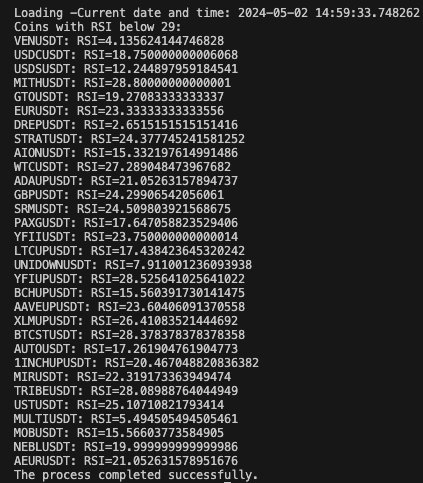

# Binance USDT Paritelerindeki RSI Değeri Kontrolü Projesi

Bu proje, Binance kripto borsasında yer alan USDT paritelerindeki coinlerin RSI (Relative Strength Index) değerlerini kontrol eden bir Python betiği içerir.

*** Binance kripto borsasında USDT paritesinde işlem gören coinlerin RSI değerlerini kontrol etmek için oluşturulmuştur.

*** RSI değeri 29'un altında olan coinlerin listesini oluşturur.

## Kullanım/Örnekler/Gereksinimler

**1. Python Kurulumu:** Bu betik Python 3 ile yazılmıştır. Bilgisayarınızda Python 3'ün yüklü olduğundan emin olun.

## Özellikler

- RSI (Relative Strength Index), bir varlığın fiyat değişim hızını ve büyüklüğünü analiz etmek için kullanılan bir teknik göstergedir.
- Bu Python betiği, her bir USDT paritesi için RSI değerini hesaplar ve RSI değeri 29'un altında olanları ekrana yazdırır.
- Bunu gerçekleştirmek için Binance API'sini kullanır ve her bir coin için son 14 saatlik kapanış fiyatlarını alır.
- Son olarak, RSI değerini hesaplar ve eğer 29'un altındaysa, coinin sembolünü ve RSI değerini ekrana yazdırır.
- Bu betiği çalıştırarak, Binance kripto borsasındaki USDT paritesindeki coinlerin RSI değeri 29'un altında olanlarını listeleyebilirsiniz.

## Bilgisayarınızda Çalıştırın


## Yükleme


Projeyi klonlayın

```bash {"id":"01HWTY2MR21TNQYS436JHZMKWG"}
  git clone https://github.com/hakantektas/crypto-ht.git
```

Proje dizinine gidin

```bash {"id":"01HWTY2MR21TNQYS436K5X2CEA"}
  cd [your_path]/crypto-ht
```

Gerekli paketleri yükleyin

crypto-ht'i npm kullanarak yükleyin

```bash {"id":"01HWTY2MR21TNQYS436NZV41TM"}
  npm i crypto-ht
```

RSI değeri 29 ve altında olan USDT paritesine sahip kripto paraları listelemek için çalıştırın

```bash {"id":"01HWTY2MR21TNQYS436RK8VA5D"}
  npm run getRSI
```

Binance borsasından tüm USDT paritelerini çeken ve bu pariteleri JSON formatında bir dosyaya yazdırmak için çalıştırın

```bash {"id":"01HWTY2MR21TNQYS436TH57CVF"}
  npm run getSymbol
```

**Sonuçları Görüntüleme:** Betik, RSI değeri 29'un altında olan coinlerin sembollerini ve RSI değerlerini ekrana yazdırır.
## Kullanılan Teknolojiler

Bu betik Python 3 ile yazılmıştır ve [OpenAI](https://openai.com/) tarafından sağlanan GPT-3 tabanlı bir yardımcı ile oluşturulmuştur.

Binance API'leri kullanılmıştır . Daha fazlası için [Binance API](https://binance-docs.github.io/apidocs/spot/en/#introduction)'leri incelenebilir .


## Python Setup

Bilgisayarınızda Python 3'ün yüklü olduğundan emin olun.Aşağıdaki adımları takip ederek yükleyebilirsiniz .


**Windows**

**1. Python.org'dan İndirme:**
Python'un resmi web sitesi olan Python.org'dan Windows için Python 3 sürümünü indirin. İndirme sayfasına buradan ulaşabilirsiniz.

**2. Kurulum:**
İndirdiğiniz dosyayı çalıştırarak Python 3'ü kurun. Kurulum sırasında, "Add Python 3.x to PATH" seçeneğini işaretleyerek Python'un PATH değişkenine otomatik olarak eklenmesini sağlayabilirsiniz.

**3. Kontrol:**
Python'un doğru şekilde yüklendiğinden emin olmak için bir komut istemi (Command Prompt) açın ve aşağıdaki komutu girin:

```sh {"id":"01HWTY2MR21TNQYS436XB43MQ2"}
python --version
```

**macOS**

**1. Homebrew ile Kurulum:**

Eğer Homebrew yüklü değilse, önce Homebrew'ü kurun:

```sh {"id":"01HWTY2MR21TNQYS436Z1C1JRV"}
/bin/bash -c "$(curl -fsSL https://raw.githubusercontent.com/Homebrew/install/HEAD/install.sh)"
```

Ardından, aşağıdaki komutu kullanarak Python 3'ü yükleyin:

```sh {"id":"01HWTY2MR21TNQYS43702VRD9D"}
brew install python
```

**2. Kontrol:**
Python'un doğru şekilde yüklendiğinden emin olmak için bir terminal açın ve aşağıdaki komutu girin:

```sh {"id":"01HWTY2MR21TNQYS43715B9DCT"}
python3 --version
```

Bu komut Python'un yüklü olduğu sürüm numarasını yazdıracaktır.

**Linux (Ubuntu/Debian)**

**1. Apt ile Kurulum:**
Terminal açın ve aşağıdaki komutu kullanarak Python 3'ü yükleyin:

```sh {"id":"01HWTY2MR3HTAG84CC1KACCH4M"}
sudo apt update
sudo apt install python3
```

**2. Kontrol:**
Python'un doğru şekilde yüklendiğinden emin olmak için bir terminal açın ve aşağıdaki komutu girin:

```sh {"id":"01HWTY2MR3HTAG84CC1PHPXGBQ"}
python3 --version
```

Bu komut Python'un yüklü olduğu sürüm numarasını yazdıracaktır.
Bu adımları izleyerek, işletim sisteminize Python 3'ü kolayca yükleyebilirsiniz.


**Katkıda Bulunma**

Bu projeye katkıda bulunmak isterseniz, lütfen bir GitHub issue açın veya bir pull request gönderin.


## Ekran Görüntüleri



